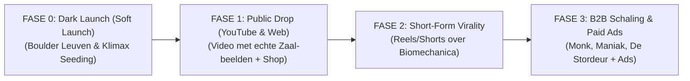

# 👑 MARKETING- & STRATEGIEPLAN: SLOPER KING™
> **Subtitel:** *The Biomechanically Engineered Sloper & Pump Trainer (<100g)*  
> **Brand & Autoriteit:** Designed by Dr. Ir. Fré Leys — *“Engineering my way to the Paralympics”*  
> **Commercieel Label:** BamBum Innovation  
> **Officiële Webshop:** [fre2028.la/sloperking](https://fre2028.la/sloperking)  
> **Datum:** September 2026  

---

## 1. ORIGIN STORY & DE BIOMECHANICA

### 1.1 Het Breekpunt: WK Paraklimmen 2025
Tijdens de eerste kwalificatieroute op het Wereldkampioenschap Paraklimmen 2025 werd Fré Leys geconfronteerd met een onverwachte uitschakeling: in de route zaten 3 opeenvolgende open slopers. Ondanks een topconditie en hoog klimniveau faalde de grip volledig door extreme onderarmverzuring (*pump*). Fré eindigde op een 11de plaats in die route en dreigde de finale te missen. In de tweede kwalificatieroute bewees hij zijn wereldniveau met een 2de plaats, waarmee hij alsnog de finale bereikte. 

**De Conclusie:** Het probleem lag niet in conditie of motivatie, maar in een specifieke biomechanische trainingsleemte. Door intensieve training op traditionele hangboards en boards (zoals het Kilterboard) was de vingerkracht voor *crimps* optimaal ontwikkeld, maar waren slopers en open-hand compressie verwaarloosd.

---

### 1.2 De Biomechanica van de Sloper vs. Crimp
Traditionele hangboards belasten uitsluitend vingerbuigers. Slopers vereisen echter een fundamenteel ander spieractivatiepatroon:

```
+-----------------------------------------------------------------------------+
|                               CRIMP TRAINING                                |
|  - Flexor digitorum profundus (FDP)                                         |
|  - Flexor digitorum superficialis (FDS)                                     |
|  => 2 Spieren actief (Hoge gewrichtsdruk op vingerkatrollen/pulleys)        |
+-----------------------------------------------------------------------------+
                                      VS
+-----------------------------------------------------------------------------+
|                            SLOPER KING TRAINING                             |
|  1. Vingerbuigers: FDP + FDS (in meer/minder gestrekte spierlengte)         |
|  2. Actieve Polsbuigers:                                                    |
|     - Flexor carpi radialis                                                 |
|     - Flexor carpi ulnaris                                                  |
|  => 4 Primaire Spieren gelijktijdig actief + diepe verzuring                 |
+-----------------------------------------------------------------------------+
```

* **Kracht-Lengte Relatie:** Spieren leveren verschillende maximale krachten afhankelijk van hun gewrichtshoek (vergelijkbaar met bicepskracht op 90° vs gestrekt). Slopers belasten de spiervezels in een meer gestrekte vingerpositie.
* **Ergonomisch & Gewrichtsvriendelijk:** Omdat de vingers open blijven, ontbreekt de schadelijke hefboomwerking op vingerkatrollen (A2/A4 pulleys), waardoor het de perfecte opwarmtool is.
* **Deep Pump Delay:** Doordat alle 4 de spieren tegelijk geactiveerd worden, kan de weerstand tegen verzuring veel dieper en specifieker getraind worden.

---

## 2. PRODUCTONTWERP & TECHNISCHE SPECIFICATIES

### 2.1 Ontkoppelings-Architectuur (Kracht vs. Vorm)
Om een ultralichte (<100g) 3D-geprinte tool te maken die extreme belastingen aankan, is het ontwerp mechanisch ontkoppeld:
* **Lastdrager:** 4mm Petzl semi-statisch koord (draagkracht: **800 kg per streng**, dubbel uitgevoerd = 1.600 kg theoretisch). Getest tot 100 kg+ trekbelasting.
* **Ergonomische Schil:** Holle/concave vorm geprint in milieuvriendelijk PLA.
* **Contactlaag:** Hoogwaardig CROP GoldX 220-grit schuurpapier voor constante wrijvingscoëfficiënt zonder huidbeschadiging.
* **5 Hoekposities:** Door het touwtje te verplaatsen over de 5 cantilever posities kan de 'sloperigheid' en polshoek stapsgewijs gevarieerd worden.

### 2.2 Productspecificaties & Inhoud Verpakking
* **Gewicht:** < 100 gram per unit (Set van 2: < 200g).
* **Materiaal:** Plant-based matzwart PLA + Petzl koord + GoldX 220 grit.
* **In the Box:**
  * 2x Sloper King™ units
  * 2x Petzl ophangkoorden (afgemonteerd)
  * 1x Katoenen draagtasje met BamBum / Sloper King stempel
  * 1x 8.5 × 12 cm Instructie- & Quickstart-kaart met QR-code

---

## 3. FINANCIËLE UNIT ECONOMICS & PRIJSSTRATEGIE

### 3.1 Kostprijsopbouw (COGS)

| Onderdeel | Leverancier / Bron | Kost per Unit (1 st) | Kost per Paar (2 st) |
| :--- | :--- | :--- | :--- |
| **PLA Filament (Matzwart)** | eSUN / Bambu Lab (~76g/unit) | € 0,93 | € 1,86 |
| **Schuurpapier (220 grit)** | CROP GoldX rol | € 0,14 | € 0,28 |
| **Draagkoord (4mm)** | Petzl (Deporvillage, 0.85m) | € 0,37 | € 0,74 |
| **Katoenen Zakje + Stempel** | Custom fabric bag | € 0,60 | € 0,60 |
| **Laser Sticker / Label** | Zwart op Wit (Custom badge) | € 0,50 | € 1,00 |
| **Info Leaflet & QR Card** | Drukwerk 8.5x12cm | € 0,70 | € 0,70 |
| **TOTAAL PRODUCTIEKOST (COGS)** | | **€ 3,24** | **€ 5,18 (~€ 5,50)** |

---

### 3.2 Prijsmodel & Kanaalmarges

| Verkoopkanaal | Product | Verkoopprijs (MSRP) | COGS | Bruto Winst | Marge % |
| :--- | :--- | :--- | :--- | :--- | :--- |
| **D2C Webshop (`fre2028.la`)** | **Set van 2 (Paar)** | **€ 39,00** | € 5,50 | **€ 33,50** | **86%** |
| **D2C Webshop (`fre2028.la`)** | **Enkel stuk (1x)** | **€ 21,00** | € 3,24 | **€ 17,76** | **85%** |
| **B2B Klimzalen / Retail** | **Set van 2 (Wholesale)** | **€ 23,00** | € 5,50 | **€ 17,50** | **76%** |

#### Waarom de officiële adviesprijs €39,00 blijft:
1. **Winkel- & Retailruimte (B2B):** Klimzalen (Boulder Leuven, Klimax) kopen in aan ~€23 en verkopen aan €39 (marge €16 voor de zaal). Als Fré zelf structureel aan €29 verkoopt, weigert elke klimzaal het product in te kopen.
2. **Paid Ads Brandstof:** Met €33,50 brutomarge per set kan Fré tot €15 per aankoop investeren in social ads en nog steeds €18,50 pure winst overhouden.
3. **Waardeperceptie:** Een officiële prijs van €39 positioneert Sloper King als een hoogwaardig biomechanisch trainingstool.

---

### 3.3 Promotiestrategie, Vriendenkorting & Lanceer-Coupons (€29 Taktiek)

In plaats van de officiële adviesprijs permanent te verlagen naar €29, hanteren we gerichte coupon- en lanceeracties. Dit combineert maximale FOMO (Fear Of Missing Out) en een sympathieke vriendenprijs zónder de B2B-retailwaarde aan te tasten:

| Doelgroep / Campagne | Mechanisme & Code | Wat de klant betaalt | Strategisch Voordeel |
| :--- | :--- | :--- | :--- |
| **Vrienden & Klimmaatjes (Gym Network)** | Code `FRIENDS29` of direct handje-contantje/Payconiq | **€ 29,00** (of €25) *(Gratis ophalen)* | Maximale gunfactor, directe beta-feedback en gratis mond-tot-mondreclame in de zaal. |
| **Publieke Lanceringsactie (Eerste 25-50 orders)** | Coupon `FOUNDER25` (-25% korting) | **€ 29,25** *(i.p.v. €39,00)* | Klanten ervaren een hoge korting op een premium product (€39 $\rightarrow$ €29). Creëert directe koopdrang bij de video-launch. |
| **Standaard Verkoop (Na launch)** | Regulier via webshop | **€ 39,00** (Paar) / **€ 21,00** (Stuk) | Blijvende gezonde marge voor advertenties en retailverkoop. |

---

## 4. MARKETING- & COMMUNICATIESTRATEGIE

### 4.1 Doelstellingen
1. **Directe Cashflow & Herinvestering:** 100% van de winst uit Batch 1 & 2 herinvesteren in social media marketing, contentcreatie en de Paralympische Road to LA 2028.
2. **YouTube & Personal Brand Launchpad:** Sloper King gebruiken als hefboom om Fré's YouTube-kanaal te lanceren rond *engineering, data, biomechanica en topsport*.
3. **E-mail Database Groei:** Klimmers en makers verzamelen via de gratis non-commercial STL download.

---

### 4.2 De "Open Core / Freemium STL" Strategie

* **Het Principe:** Fré stelt de 3D-bestanden (STL) gratis beschikbaar onder een **Creative Commons CC BY-NC 4.0** licentie (enkel persoonlijk, niet-commercieel gebruik).
* **De Ruil (Lead Magnet):** De STL kan enkel gedownload worden via `fre2028.la/sloperking` in ruil voor een e-mailadres (*"Waar mogen we het bestand en de printgids naartoe sturen?"*).
* **Waarom dit commercieel werkt:**
  * 85% van de klimmers heeft geen 3D-printer of zin om zelf koorden/griptape te snijden $\rightarrow$ Zij kopen direct de afgewerkte set van €39.
  * De 15% makers printen het, nemen het mee naar de klimzaal en worden gratis ambassadeurs.
  * Fré bouwt een gigantische e-maillijst van geëngageerde klimmers op voor toekomstige producten en LA 2028 updates.

---

## 5. HET 4-FASEN LANCERINGSPLAN



### Fase 0: De Regionale "Dark Launch" in 6 Top-Klimzalen (Week 1–2)
*Doel: 48 sets fysiek in de markt zetten, feedback verzamelen en virale B-roll schieten met lokale topklimmers vóór de grote online drop.*

* **De 6 Sleutelzalen in Vlaanderen & Brussel (8 sets per zaal = 48 sets totaal):**
  1. **Boulder Leuven** *(Thuisbasis Leuven)*
  2. **De Stordeur Leuven** *(Lead & endurance klimmers)*
  3. **Klimax Puurs** *(Nationaal trainingscentrum & topsportatleten)*
  4. **The Island / Blok Antwerpen** *(Grootste bouldergemeenschap Antwerpen)*
  5. **Rhino Boulder / Bleau Gent** *(Gentse klim- & maker community)*
  6. **Petite Île / Maniak Brussel** *(Internationaal & tweetalig publiek)*

* **Het "Local Legend" Seeding & Content Protocol:**
  * Test in elke zaal het demopaar direct met een **bekende lokale klimmer, routebouwer of nationaal atleet**.
  * *Filmen op smartphone (30 sec clip):*
    1. De atleet test de Sloper King op positie 4 of 5 (kabel of stang).
    2. Close-up van de aanspannende onderarmspieren + reactie op de diepe verzuring.
    3. Ongefilterd eindoordeel: *"Waarom voelt dit anders dan een crimp hangboard?"*
  * *Social Boost:* Geef de atleet een set cadeau; zij delen de ervaring organisch in hun Instagram Stories en taggen `@fre_leys`.

* **Financiële Snapshot van de Dark Launch (48 Sets):**
  * Productiekost (COGS): $48 \times €5,50 = \mathbf{€264,00}$
  * Wholesale Omzet (€23/set): $48 \times €23,00 = \mathbf{€1.104,00}$
  * **Jouw Netto Winst:** $\mathbf{€840,00}$ *(directe cashflow voor marketing/LA2028)*
  * Gecombineerde Zaalwinst: $48 \times €16,00 = \mathbf{€768,00}$

* **De 60-Seconden Quickstart Video (Unlisted):**
  * Korte smartphone-instructieclip (60–90 sec) die toont hoe je de 5 hoeken instelt en de 3 trainingsmethodes gebruikt.
  * Ingesloten op `fre2028.la/sloperking` voor iedereen die de QR-code op de displays/kaartjes in de zaal scant.

### Fase 1: De Grote Public Drop (YouTube & Webshop Launch) (Week 3)
*Doel: Maximale conversie naar zowel de online webshop als de fysieke partnerzalen.*
* **De Grote YouTube Video 1 (8–10 min - 100% PUBLIC):**
  * *Titel-opties:*
    * **Optie A (Aanrader):** *"I Built a Tool to Train Slopers... and Accidentally Created the Ultimate Pump Trainer"*
    * **Optie B:** *"The Biomechanics of Slopers vs. Crimps (And Why You're Pumping Out)"*
    * **Optie C:** *"Why Slopers Feel Impossible (And How to Actually Train Them)"*
  * *Verhaallijn:* Wat zijn slopers? $\rightarrow$ WK 2025 mislukking $\rightarrow$ Biomechanica (4 spieren) $\rightarrow$ 3D Prototype & 800kg koord $\rightarrow$ Toevallige ontdekking (pump master) $\rightarrow$ **Echte reacties & beelden uit Boulder Leuven/Klimax** $\rightarrow$ **CTA.**
* **Professionele YouTube Optimalisatie vóór Release:**
  * *Short-Form Hook Pre-Testing:* Test 3 hooks op Instagram Reels/TikTok; de hoogste 3s-retention bepaalt de video-intro.
  * *Pre-Launch Thumbnail Check ([Thumbsup.tv](https://thumbsup.tv)):* Controleer mobiele leesbaarheid en dark mode.
  * *YouTube Studio Native "Test & Compare":* Upload direct 2-3 thumbnails voor automatische A/B testing op basis van Watch Time Share.
* **Webshop Live & Call to Action:** 
  * Directe online verkoop via `fre2028.la/sloperking` (met lanceercode `FOUNDER25`).
  * Lokale klimmers doorverwijzen: *"Vanaf vandaag ook direct mee te nemen aan de balie van Boulder Leuven en Klimax!"*

### Fase 2: Short-Form Content Blitz (Week 4–8)
Knip de long-form video op in 6 gerichte shorts voor Instagram, TikTok en Facebook:
1. **Clip 1 (De Fout):** *"Waarom 90% van de klimmers leegloopt op slopers..."* (Polsbuigers vs vingerbuigers).
2. **Clip 2 (Breektest):** *"Houdt een 3D-print 100 kg lichaamsgewicht?"* (Visuele trektest).
3. **Clip 3 (Opwarmen):** *"Stop met opwarmen op 20mm crimps"* (Blessurepreventie en vingerkatrollen).
4. **Clip 4 (Kabelmachine):** *"Waarom de fitness kabelmachine superieur is aan een hangboard"* (Exacte load instellen voor verzuring).
5. **Clip 5 (Maker Timelapse):** *"Van CAD prototype naar afgewerkt product in 30 seconden"*.

### Fase 3: B2B Zaal-Distributie & Paid Ads (Vanaf Maand 2)
* **B2B Consignatiemodel (Zero-Risk Terugkoopgarantie):**  
  * *Het Aanbod:* Lever een proefdoos van 5 tot 10 sets aan klimzalen (Boulder Leuven, Klimax, Monk) op basis van consignatie (of 100% teruggaverecht na 60 dagen). 
  * *Pitch:* *"Verkoopt het niet? Dan neem ik ze kosteloos terug (nul risico voor de zaal). Verkoopt het wel? Dan factureren we aan €23/set en pakt de zaal €16 pure winst per paar."*
* **Meta Ads:** Zet €5–€10/dag advertentiebudget op de beste video-hook gericht op klimmers in BE, NL, DE en FR.

---

## 6. GEBRUIKSPROTOCOLLEN & TRAININGSMETHODES

In de communicatie en op de infokaart onderscheiden we 3 gebruiksmethodes:

1. **Fitness Kabelmachine (Fré’s Favoriet & Meest Effectief):**  
   *Bevestig aan de katrol van een kabeltoestel. Hierdoor kan de load exact in kilo's ingesteld worden. Ideaal voor zowel maximale kracht (hoge load, 5-7s) als verzuringstraining (lagere load, 30-45s continue spanning).*
2. **Floor Pick-Ups (Draagbaar met Kettlebell/Gewichtschijf):**  
   *Bevestig aan een gewicht en til op vanaf de grond. Zeer veilig en reproduceerbaar zonder pull-up bar.*
3. **Pull-Up Bar / Counterweight (Traditioneel Lichaamsgewicht):**  
   *Hang aan een stang thuis of aan de rots voor opwarming of hangboard-stijl training.*

---

## 7. WEBSHOP ARCHITECTUUR (`fre2028.la/sloperking`)

1. **Hero Header:**
   * Productbadge met goud kroontje op zwarte achtergrond.
   * Directe knop: `[ Bestel Set van 2 — €39,00 ]` / `[ Bestel Enkel Stuk — €21,00 ]`.
   * Verzendbadge: *Leuven: Gratis | BE: €3,99 | EU: €4,99*.
2. **3 Core Unique Selling Points (USP's):**
   * 🔬 **4-Spier Biomechanica:** Traint FDP, FDS én de 3 polsbuigers.
   * 🛡️ **Gewrichtsvriendelijk:** Ideale opwarming zonder hefboom op vingerkatrollen.
   * 🪶 **<100g Pocket Tool:** 800kg Petzl load rating in zakformaat.
3. **The Origin Story (Kort videofragment + tekst):** Het verhaal van het WK 2025.
4. **Maker & Open Source Corner (Footer):**
   * *"Heb je zelf een 3D-printer? Download gratis de officiële STL + Print & Veiligheidshandleiding (CC BY-NC)."*
   * E-mail invoerveld met directe webhook naar geautomatiseerde downloadlink.

---

## 8. KLIMZAAL RETAIL & FYSIEKE DISPLAY STANDS

Om in klimzalen maximale rotatie te krijgen zonder dat het personeel actief moet verkopen, voorzien we **2 fysieke touchpoints in de zaal**:

### 8.1 Touchpoint 1: De "Test-Stand" in de Opwarmzone
* **Plaatsing:** Permanent opgehangen aan de pull-up bar of de hangboard-balk in de opwarm- en trainingsruimte van de zaal.
* **Componenten:**
  * 1 Demopaar Sloper King™ (bevestigd met snelsluiting/musketon).
  * Gelamineerd hangkaartje (10x15 cm):
    > **SLOPER KING™ — Test hier de polsactivatie & opwarming!**  
    > *Ervaar het verschil met een crimp. Weegt <100g. Verkrijgbaar aan de balie (€39 / set van 2).*  
    > `[ QR-code: "Bekijk 60s Biomechanica & Oefeningen" ]`

### 8.2 Touchpoint 2: De A5 Balie / Toonbank Explainer Display
* **Formaat:** Staand A5 formaat in een transparante acryl houder (of met een custom 3D-geprint voetje).
* **Plaatsing:** Direct naast de kassa op de toog waar de afgewerkte katoenen zakjes gestapeld liggen.
* **Inhoud op het bordje:**
  1. **Kop:** *SLOPER KING™ — Designed by Dr. Ir. Fré Leys (Top-5 Paraklimmer WK 2025)*
  2. **Kernboodschap:** *Train de 4 onderarmspieren die traditionele hangboards vergeten.*
  3. **3 Snelle Features:**
     * ⚡ **Deep Pump Resistance:** Train verzuring zonder vingerblessures.
     * 🪶 **<100g Pocket Size:** 800kg Petzl koord in broekzakformaat.
     * 🎯 **5 Instelbare Hoeken:** Van subtiele grip tot extreme sloper.
  4. **Call to Action & Prijs:** *Vraag ernaar aan de balie — **€39,00** (Complete Set van 2 incl. draagtasje & instructiekaart).*

---

## 9. B2B ZAAL-PITCH & 2-MINUTEN VIDEOSCRIPT

Om zaaluitbaters snel en persoonlijk te overtuigen, neemt Fré een smartphone/Loom-video van ~2 minuten op:

### 9.1 Het 2-Minuten Videoscript
* **[0:00 – 0:30] Intro & Herkenning:**  
  > *"Hey [Naam/Zaalteam]! Fré Leys hier. Naast paraklimmer in het Belgisch team (Road to LA 2028) ben ik ook ingenieur biomechanica aan de KU Leuven. Vorig jaar op het WK werd ik met mijn neus op de feiten gedrukt: mijn vingerkracht op crimps was wereldklasse, maar in een kwalificatieroute met drie zware slopers liepen mijn onderarmen compleet vol en viel ik eruit. Mijn conclusie? Er bestond eigenlijk geen compacte manier om die specifieke polsactivatie en open-hand verzuring te trainen."*
* **[0:30 – 1:00] De Oplossing (Toon Sloper King):**  
  > *"Daarom heb ik de Sloper King™ ontwikkeld: een lichte 3D-tool (<100g) met 5 hoeken, ontkoppeld van een 800kg Petzl-koord. Ik train er nu zelf maanden op: niet alleen mijn sloperkracht is ontploft, maar het blijkt vooral dé ultieme blessurevrije manier om diepe verzuring te trainen en op te warmen."*
* **[1:00 – 1:35] Het No-Risk Voorstel:**  
  > *"Binnenkort lanceer ik dit officieel, maar ik wil als eerste samenwerken met een select aantal topzalen in België. Mijn vraag is heel eenvoudig:  
  > 1. Ik kom gratis een test-stand ophangen in jullie opwarmzone.  
  > 2. Ik zet een proefdoosje van 8 sets bij jullie aan de balie, volledig op consignatie.  
  > Nul financieel risico voor jullie: verkoopt het niet na 60 dagen, dan neem ik ze kosteloos terug. Verkoopt het wel, dan pakken jullie €16 pure winst per set (€128 marge op het doosje bij MSRP €39)."*
* **[1:35 – 2:00] Call to Action:**  
  > *"Het lijkt me supervet om komende week even bij jullie binnen te springen met een demopaar. Laat me gerust weten welke dag past. Hopelijk tot snel in de zaal!"*

### 9.2 Begeleidend WhatsApp/Mail Bericht
> *"Hey [Naam]! 👋 Fré Leys hier (Belgisch paraklimmer & ingenieur). Ik heb een korte videoboodschap van 1,5 minuut voor jullie opgenomen over een nieuwe biomechanische trainingstool die ik heb ontwikkeld (de Sloper King) en een no-risk voorstel voor in [Zaalnaam]. Check zeker even het filmpje hierboven! Zullen we komende week even kort afspreken in de zaal? 🧗‍♂️"*

---

## 10. 2-WEKEN OPERATIONELE ACTIELIJST (TO-DO LIST)

### 🗓️ WEEK 1: Productie, Quickstart Video & Zaal-Contacten

#### Hardware & Productie (Thuis):
- [ ] **3D-Print Batch 1:** Print de eerste 48 units (goed voor 24 complete sets / 3 klimzalen).
- [ ] **Assemblage:** Petzl 4mm koorden op 85 cm snijden/knopen + GoldX 220 grit aanbrengen.
- [ ] **Verpakking:** Katoenen zakjes stempelen + 8.5x12 cm QR-instructiekaarten printen.

#### Content & Webshop:
- [ ] **60s Quickstart Video filmen:** Korte smartphone-opname over de 5 hoeken & 3 oefeningen.
- [ ] **Uploaden:** Op YouTube zetten als **Unlisted (Verborgen)**.
- [ ] **Webpagina (`fre2028.la/sloperking`) activeren:** Video insluiten + Stripe checkout/pre-order live zetten.

#### B2B Outreach & Displays:
- [ ] **Selecteer 6 Zalen:** Maak de definitieve lijst van 6 doelzalen en contactpersonen.
- [ ] **Personal Pitch Video's opnemen:** Neem het 2-minuten WhatsApp/Loom filmpje op voor de 6 zaaluitbaters en verstuur met het begeleidende appje.
- [ ] **Displays klaarmaken:** Print 6x de A5 toogdisplay en monteer 6x de test-stand demoparen met hangkaartjes.

---

### 🗓️ WEEK 2: Zaal-Drop, Local Legends & Voorbereiding Public Launch

#### Fysieke Zaal-Drop (6 Zalen bezoeken):
- [ ] **Plaatsing:** Hang in elke zaal de Test-Stand op en zet de proefdoos van 8 sets op consignatie aan de kassa.
- [ ] **Local Legend Seeding:** Laat een lokale topper / routebouwer in de zaal het demopaar testen.
- [ ] **B-Roll filmen:** Schiet 30s smartphone-reacties van klimmers die de extreme pomp voelen.

#### Grote Public YouTube Video:
- [ ] **A/B Hooks Pre-Testen:** Plaats 3 korte Reels op Instagram/TikTok om de beste 3s-retention hook te bepalen.
- [ ] **Montage Video 1:** Monteer de 8–10 min video (WK verhaal $\rightarrow$ Biomechanica $\rightarrow$ Accidental Pump Master discovery $\rightarrow$ Live zaalbeelden $\rightarrow$ CTA).
- [ ] **Thumbnails checken:** Test op Thumbsup.tv en bereid 2–3 varianten voor in YouTube Studio.
- [ ] **Go Live! (Fase 1 Drop):** YouTube video op Public, social media blitz op Instagram/LinkedIn/Facebook en webshop open.
