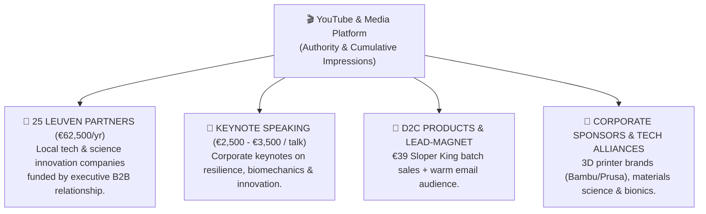

# FRE2028 Content & YouTube Master Strategy
**Executive Summary & Strategic Knowledge Base for Brainstorming & Production**
*Channel Name:* **Fré Leys** *(Alternative brand tags: "Fré Leys | The Lab" or "Fré Leys | Engineering Impossible" — avoids narrowing TAM to climbing)* | *Creator:* Fré Leys (Dr. Ir. on LinkedIn/Corporate) | *Campaign:* Road to LA 2028 Paralympics | *Strategist:* Stan

---

## 1. Executive Overview & The Creator "Moat"

Fré Leys is uniquely positioned at the intersection of elite athletics, mechanical engineering, and open-source maker culture. This creates an untouchable **four-layer moat** that separates his content from 99.9% of sports and fitness creators.

```
┌────────────────────────────────────────────────────────────────────────┐
│                      DR. IR. FRÉ LEYS — THE MOAT                       │
├────────────────────────────────┬───────────────────────────────────────┤
│ 1. THE ENGINEER & MAKER        │ • PhD in Mechanical Engineering (KU Leuven).   │
│                                │ • Thesis: Bio-inspired Robotic Hummingbird     │
│                                │   (KULibrie — aerodynamics & micro-mechanics). │
│                                │ • Designs custom 3D-printed climbing hardware, │
│                                │   force sensors, and data-analysis software.   │
├────────────────────────────────┼───────────────────────────────────────┤
│ 2. THE WORLD-TOP ATHLETE       │ • 2x World Cup Gold Medalist (Los Angeles,    │
│                                │   Salt Lake City) + 6 international podiums.  │
│                                │ • Top 4 most experienced paraclimbers in the  │
│                                │   entire history of the sport.                │
├────────────────────────────────┼───────────────────────────────────────┤
│ 3. THE INSIDER & STATESMAN     │ • Official Athlete Representative for the     │
│                                │   IFSC (World Climbing) representing ALL       │
│                                │   international athletes (able-bodied & para).│
│                                │ • Direct insider access to isolation zones,   │
│                                │   route-setting decisions & governance.       │
├────────────────────────────────┼───────────────────────────────────────┤
│ 4. THE HISTORIC QUEST (LA2028) │ • Paraclimbing makes its Paralympic debut at  │
│                                │   Los Angeles 2028.                           │
│                                │ • Target: First-ever Belgian paraclimbian and │
│                                │   first-ever Paralympian from Leuven.         │
└────────────────────────────────┴───────────────────────────────────────┘
```

---

## 2. Core Positioning: The Inverted "Trojan Horse" Strategy

### The Market Reality: Package for Makers, Deliver Climbing
The climbing-training audience is niche (channels like Hooper's Beta took years to reach ~150k). In contrast, the **Maker, Engineering & Physics audience** (Stuff Made Here, Breaking Taps, This Old Tony, Mark Rober) is an order of magnitude larger—and craves a hyper-competent builder in a real workshop testing physical prototypes to destruction.

We **invert the traditional sports Trojan Horse**:
1. **The Packaging (The Maker Hook):** Broad curiosity-driven engineering, materials science, CAD mechanics, and physical stress tests (*"I Built a Prosthetic Foot That Grips Better Than a Climbing Shoe"*, *"Can a 3D Print Hold 200 kg?"*, *"I Built a Transparent Climbing Wall"*).
2. **The Delivery (The Climbing Reality):** World-top athletic testing, live biomechanics, sensor telemetry, and IFSC World Cup reality.
3. **The Language:** Minimize internal climbing jargon (no uncontextualized grade-talk like "V12" or "gaston"). Frame problems around universal physical forces: lever arms, torque, shear stress, friction coefficients, and tendon strain.

### The Natural Prosthetic Rule (Never Hidden, Never Pity Bait)
- **Natural Visibility in First 10 Seconds:** Fré's prosthetic foot/leg is visible naturally on camera within the first 10 seconds (stepping onto the mats, standing at the workbench, or pulling onto a hold).
- **No 'Late Reveal' or Emotional Manipulation:** Never hide the prosthetic only to spring it as a mid-video plot twist. Modern viewer satisfaction surveys punish feeling manipulated.
- **Competence Over Narrative:** Fré is an elite world-class athlete and PhD engineer solving hard physics problems. The viewer sees a guy with a carbon prosthetic pulling on 7c boulders in an advanced workshop—competence is 100% self-evident without an introductory lecture.

### The Core Channel Sentence (The North Star Value Proposition):
> **"I build things to climb harder — and then test whether they actually work."**

Everything in the channel hangs directly on this one clear, active sentence:
* **Bionic Prosthetic Foot:** I built it to climb harder ➡️ testing on 2mm micro-edges on camera.
* **Sloper Tool:** I built it to fix wrist torque ➡️ testing on glassy 50° fiberglass.
* **Uneven Hangboard:** I built it for anatomical finger lengths ➡️ testing tendon load distribution.
* **Force Sensors & Telemetry:** I built them to measure peak hold forces ➡️ testing live on the wall.
* **200 kg Rig Test:** I printed climbing rungs ➡️ hydraulic destructive testing to catastrophic fracture.
* **Transparent Wall:** I built clear thermoformed modular tiles ➡️ testing face-on climbing angles in the living room.
* **Schubert Custom Grip:** I built it for a 6x World Champion ➡️ testing with the strongest climber on earth.

---

## 3. The Narrative Engine: Fré Leys & The "Iceberg Principle"

### A. You Are the Defensible Long-Term Asset
The engineering projects attract the viewer, but **Fré Leys and his human journey make them stay**.
* Eventually, another creator can test 3D prints, build a prosthetic, or put sensors on climbing holds.
* **Nobody on earth can duplicate Dr. Ir. Fré Leys fighting to reach LA 2028.**
* We deliberately embed authentic human reality inside the engineering narrative:
  - Real training setbacks, physical fatigue, and competition pressure.
  - Engineering experiments that fail, prototypes that crack, or designs that hit dead-ends.
  - Design choices regretted and time/budget constraints.
  - Ridiculous, obsessive engineering details (e.g. spending 4 hours obsessing over a 0.2mm radius).
  - Unfiltered, genuine interactions with elite peers (Jakob Schubert, Hannes Van Duysen).
* This is not conventional "vlog content" — it is **high-stakes character storytelling embedded inside hard engineering**.

### B. The Finite Story Clock (The LA 2028 Narrative Arc)
Most YouTube channels have no narrative ending. Fré has something extraordinarily rare: **a ticking clock with a built-in climax**.  
The LA 2028 Paralympic Games run **August 15–27, 2028** (Para Climbing: **August 24–27, 2028**). This gives the channel a dramatic multi-year arc:
* **2026:** *"Can I build this?"* (Radical R&D, workshop prototypes, breaking things, proving concepts).
* **2027:** *"Can I become good enough?"* (Athletic progression, international IFSC World Cups, refining hardware under pressure).
* **Early 2028:** *"Can I qualify?"* (Selection trials, cut-throat qualification pressure, emotional stakes).
* **Summer 2028:** *"I made it."* (The final physical and mental countdown).
* **LA 2028:** *"What happens when the experiment finally reaches the biggest test on earth?"*
* **Post-LA 2028:** *"What do I do after becoming a Paralympian?"* (The next chapter).

### C. The Iceberg Principle (Why We Never Scream "I'M TRAINING FOR THE PARALYMPICS!")
Traditional sports creators shout their mission from second one: *"Welcome back to my road to the Paralympics vlog!"*  
This alienates cold viewers, limits reach, and triggers charity/pity fatigue.

Instead, we apply the **Iceberg Principle (Emergent Discovery)**:
1. **The Tip of the Iceberg (The Video):** Pure curiosity-driven maker & physics problem-solving. An engineer building wild prototypes, breaking 3D prints, and testing them on steep walls.
2. **Never "DISABLED ATHLETE BUILDS..." (Competence First):** Packaging is: *"I Built a Foot That Climbs"* — never pity-baiting or charity framing. The viewer clicks out of curiosity and respect for competence. The disability is an authentic, integral part of the reality, but never a marketing gimmick.
3. **The Emergent Discovery (The "Oh Shit" Moment):** Viewers see world-class movement, IFSC badges on the wall, and the countdown board (`LA 2028: 840 DAYS`). In the comments, viewers organically realize:  
   > *"Wait... I thought he was just a crazy talented engineer making climbing gear. He's literally one of the best paraclimbers on earth engineering his own hardware to win Paralympic Gold?!"*
4. **The Result:** Viewers root 100× harder for a protagonist they discover on their own.

### The 4 Operating Principles:
1. **The Iceberg Discovery (Never Shout LA 2028):** Keep the video 100% focused on the build and test. Let the Paralympic quest emerge naturally through the world-building, workshop whiteboard, and athletic stakes.
2. **Never Pretend to Know Everything:** Frame every project as an honest empirical test (*"I had this hypothesis, let's build a prototype and test if it fails."*).
3. **High-Yield Insights:** Every video must deliver at least 2–3 mind-blowing mechanical insights or physical facts that make the viewer feel like an insider.
4. **Radical Transparency:** Show the broken 3D prints, the failed CAD iterations, and the slips on the wall. Never fake a test.

---

## 4. The Zero-Ritual Episode Architecture & Fluid Storytelling

Modern YouTube viewers decide within 15–30 seconds whether to stay. Deliver on the thumbnail promise immediately:

```
[0:00 - 0:15] 💥 THE COLD PHYSICAL HOOK (Zero Ritual / Direct Payoff)
              • Concrete physical artifact in hand or dramatic physical action.
              • Direct answer to the thumbnail promise within 3 seconds.
              • Prosthetic visible naturally in frame; ZERO channel logos, NO "welcome back".

[0:15 - 0:30] 🧬 THE PLAIN-ENGLISH HYPOTHESIS & CREDENTIALS AS EVIDENCE
              • State the engineering challenge directly:
                "This is a prosthetic foot designed specifically for climbing."
              • Do NOT list degrees aloud ("I'm Fré Leys, PhD engineer and elite climber...").
                Instead, PROVE that you're interesting through action. Credentials are
                evidence that emerges on screen, never spoken exposition.

[0:30 - Midpoint] 🛠️ THE CAD BUILD, ITERATIONS & FAILED PRINTS
              • Rapid CAD in Fusion 360 + 3D printing/machining timelapse.
              • Real workshop friction: show v1 snapping, poor tolerances, or delamination.
              • The "Kindergarten Physics" insight: Explain the mechanics using everyday analogies.

[Midpoint - Climax] 🧪 THE REAL-WORLD TEST & DESTRUCTION
              • Test 1: Destructive testing to failure in a static test rig with a load cell /
                1000 FPS slow-motion capture (zero human injury risk).
              • Test 2: Athletic trial on the climbing wall using verified, safe components.
              • Sensor telemetry overlays and clear data verdict.

[Ending] 🎁 OPEN HARDWARE & TEASER (30-45 Seconds)
              • Free open-source STL/CAD personal download link on fre2028.la (CC BY-NC).
              • Quick 5-second teaser of the next build.
```

### Video Length: Fluid & Narrative-Driven (No Dogmatic 8–14 Min Rule)
There is no universal "optimal" YouTube video length. YouTube explicitly states that the right duration depends entirely on the content, narrative density, and audience retention:
* The **Bionic Foot** film might need **13 to 15 minutes** to breathe.
* The **200 kg Rig Test** might be explosive and perfect at **7:40**.
* The **Jakob Schubert Collab** could easily earn **17 to 20 minutes**.
* **The Rule:** Never pad a thin video to reach 10:00, and never butcher a compelling story to satisfy an arbitrary ceiling. Let **audience retention curves** show where interest actually drops.

> 📋 **Production Quality Gate:** Every script, experiment, thumbnail, and final export must be vetted against the 27-section [MASTER_YOUTUBE_CHECKLIST.md](file:///c:/Users/frede/Documents/GitHub/fre2028-website/_youtube/MASTER_YOUTUBE_CHECKLIST.md) (Fit, Story, Script, Engineering, Stranger Test, Safety & Post-Upload Autopsy).

---

## 5. Master Library of Content Blueprints

### 🛡️ The Concept Overload Filter (Disciplined Selection)
Having 30+ brilliant concepts is intellectually exciting, but operationally dangerous. Without a strict filter, you jump between NIRS sensors, AI vision, and eye tracking without establishing a cohesive brand identity.

Every idea must pass this single test before entering production:
> **"Can the title and premise be understood by someone who has NEVER climbed?"**

#### The Portfolio Ratio for the First 10–15 Videos:
* **70% Broad Curiosity & Maker Spectacle:** Hard engineering, material failures, bionics, physics, 3D printing.
* **20% Climbing Performance & Biomechanics:** Elite training, ergonomics, contact mechanics.
* **10% Pure Personal / LA 2028 Stakes:** The real-world journey, qualification battles, failure analysis.

---

### 🚀 Phase 1: The Active Launch Slate (November 2026 → Voorjaar 2027)
*Zie het complete 16-maanden publicatieoverzicht in [CONTENT_PLANNING_16_MONTHS.md](file:///c:/Users/frede/Documents/GitHub/fre2028-website/_youtube/CONTENT_PLANNING_16_MONTHS.md).*

#### 🎬 Video 1 (HW-01): The Sloper King & Power Endurance
* **Dossier & Folder:** [EP01_SLOPER_KING_POWER_ENDURANCE/](file:///c:/Users/frede/Documents/GitHub/fre2028-website/_youtube/EP01_SLOPER_KING_POWER_ENDURANCE/README.md)
* **Dedicated Script:** [YOUTUBE_SCRIPT_SLOPER_KING.md](file:///c:/Users/frede/Documents/GitHub/fre2028-website/_youtube/EP01_SLOPER_KING_POWER_ENDURANCE/YOUTUBE_SCRIPT_SLOPER_KING.md)
* **YouTube Title:** *Why Climbers Suck at Slopers (And the Secret to Insane Power Endurance)*
* **Strategic Purpose:** Product Launch #1 (Sloper King) in november vlak voor de feestdagen. Combineert frictietribologie, de gewicht-paradox en de ontdekking van de ultieme occlusiepomp voor onderarmen.

---

#### 🎬 Video 2 (HW-07 / HW-11): Can a 3D Print Hold 800 kg?
* **Dossier & Folder:** [EP02_3D_PRINT_800KG_RIG_TEST/](file:///c:/Users/frede/Documents/GitHub/fre2028-website/_youtube/EP02_3D_PRINT_800KG_RIG_TEST/README.md)
* **YouTube Title:** *Can 3D-Printed Climbing Gear Hold 800 kg? (Hydraulic Destruction Test)*
* **Strategic Purpose:** Bewijst onverwoestbare ingenieurskracht en bouwt absoluut vertrouwen op voor 3D-geprinte hardware (Sloper King & Fingerprint).

---

#### 🎬 Video 3 (BIO-02 / PARA-01): I Gave an Elite Climber a Prosthetic Leg
* **Dossier & Folder:** [EP03_ALL_ABOUT_AMPUTEE_CLIMBING/](file:///c:/Users/frede/Documents/GitHub/fre2028-website/_youtube/EP03_ALL_ABOUT_AMPUTEE_CLIMBING/README.md)
* **YouTube Title:** *I Gave an Elite Climber a Prosthetic Leg (It Did Not Go Well)*
* **Strategic Purpose:** De grote virale mainstream uitbraak (150k–500k views). Toont de brutaliteit van amputee klimmen via humor en experiment zonder zieligheid.

---

#### 🎬 Video 4 (HW-02): The Fingerprint Hangboard & A2 Pulley Fix
* **Dossier & Folder:** [EP04_FINGERPRINT_HANGBOARD/](file:///c:/Users/frede/Documents/GitHub/fre2028-website/_youtube/EP04_FINGERPRINT_HANGBOARD/README.md)
* **YouTube Title:** *Why Standard Hangboards Injure Your Fingers (The A2 Pulley Fix)*
* **Strategic Purpose:** Product Launch #2 (Fingerprint Hangboard). Iedere vinger heeft een andere lengte; vlakke hangboards overbelasten pezen.

---

#### 🎬 Video 5 (COL-01): Jakob Schubert Custom Grip
* **Dossier & Folder:** [EP05_JAKOB_SCHUBERT_CUSTOM_GRIP/](file:///c:/Users/frede/Documents/GitHub/fre2028-website/_youtube/EP05_JAKOB_SCHUBERT_CUSTOM_GRIP/README.md)
* **YouTube Title:** *I 3D-Printed a Custom Training Grip for World Champion Jakob Schubert*
* **Strategic Purpose:** Internationale elite-collab. Enorme abonneesprong door het bereik van 6x wereldkampioen Jakob Schubert.

---

#### 🎬 Video 6 (SW-01): Kilter Board 50k Analysis
* **Dossier & Folder:** [EP06_KILTER_BOARD_ANALYTICS/](file:///c:/Users/frede/Documents/GitHub/fre2028-website/_youtube/EP06_KILTER_BOARD_ANALYTICS/README.md)
* **YouTube Title:** *I Analyzed 50,000 Kilter Board Climbs (The Most Sandbagged Holds)*
* **Strategic Purpose:** Big data, algoritmes en app software virality.

---

#### 🎬 Video 7 (HW-08): Transparent Climbing Wall
* **Dossier & Folder:** [EP07_TRANSPARENT_CLIMBING_WALL/](file:///c:/Users/frede/Documents/GitHub/fre2028-website/_youtube/EP07_TRANSPARENT_CLIMBING_WALL/README.md)
* **YouTube Title:** *I Built a Transparent Climbing Wall in My Living Room*
* **Strategic Purpose:** Visueel spektakel en maker-doorbraak. Filmen van voren door transparante dieptrek-tegels.


---


---

### 👤 PART 2: Master Blueprint Backlog (Categorized by Origin)

#### A. 3D-Printed Hardware & Maker Projects
1. **The Sloper King:** *I Built a 3D-Printed Tool to Grip Impossible Slopers*  
   *The Sloper King lightweight open-hand device; 3 months of testing; friction mechanics & wrist stabilization.*
2. **The Uneven Crimp:** *Your Fingers Aren't the Same Length (So I Built an Uneven Hangboard)*  
   *Custom staggered edge reflecting anatomical finger length differences for elite recruitment, equal load distribution, and injury prevention.*
3. **Ergonomic Hold Design:** *Why Most Climbing Holds Are Poorly Designed (And How I Make Mine)*  
   *Custom shaping, dual-texture, CAD modeling, and polyurethane/3D prototyping.*
4. **Custom Bionic Prosthetic:** *I Built a Prosthetic Foot That Grips Better Than a Climbing Shoe*  
   *Bionic climbing foot design, socket CAD in Fusion360, carbon layup, and testing on the wall.*
5. **Non-Board Finger Training:** *How to Build Elite Finger Strength Without a Hangboard*  
   *Portable lifting pins, progressive weight loading for gyms and travel.*
6. **Extreme Prosthetic Experiments (Viral Maker Episode):** *I Built 3 "Extreme" Prosthetics (Super Jump, Ultra-Long & Drill Attachment)*  
   *Wild engineering testing: building experimental extreme prosthetic attachments (pneumatic jump booster, extra-long leverage leg, tool mount) and stress-testing what happens on the climbing wall.*

#### B. Software, Sensors & Telemetry
7. **The Kilter Board Engine:** *I Analyzed 50,000 Kilter Board Climbs (The 3 Holds Everyone Ignores)*  
   *Kilter Board Analysis App; route database, heatmaps, and blind spots in training routes.*
8. **Live Wall Force Sensors:** *I Put Force Sensors on the Wall to Measure How Hard We Actually Pull*  
   *Custom load cell sensors on climbing holds + live Bluetooth telemetry and readout.*
9. **Heartbeat Fall Predictor:** *Can an Algorithm Predict When You Will Fall? (Heart Rate vs. Pump)*  
   *Heart rate telemetry vs. muscular pump failure during lead climbing.*

#### C. Biomechanics, Body & Biohacking
10. **Hangboard Physics & Myths:** *What Everyone Gets Wrong About Hangboard Training (According to Physics)*  
    *TUT (time under tension) misconceptions vs. tendon creep and neuromuscular recruitment.*
11. **Prosthetic Climbing Biomechanics:** *The Brutal Physics of Climbing With a Prosthetic*  
    *Biomechanical torque loss, ankle mechanics, balance compensation, and lack of sensory feedback.*
12. **Pinch Grip Biomechanics:** *How to Build Unstoppable Pinch Grip Strength (Biomechanics & Tools)*  
    *Thenar muscle recruitment, thumb opposition, and custom pinch blocks.*
13. **Medical DXA Scan:** *I Got a Medical DXA Scan to Build the Optimal Climbing Body*  
    *Full-body DXA scan: bone density, lean mass distribution, and power-to-weight ratio.*
14. **Evidence-Based Supplements:** *The Only 4 Supplements Proven to Work for Climbers*  
    *Evidence-based science of Creatine, Vitamin D3, Vitamin C, and Folate.*

#### D. Elite Collaborations, Sports Business & Documentary
15. **The Jakob Schubert Custom CNC Grip:** *I CNC-Milled a Custom Training Grip for World Champion Jakob Schubert*  
    *Handprint mold casting ➡️ 3D scanning ➡️ CAM toolpaths ➡️ CNC-milled custom wooden ergonomic grip.*
16. **Slab & Extreme Rubber Friction:** *Testing Extreme Rubber Friction with World Champion Hannes Van Duysen*  
    *Microscopic rubber friction physics on slick volumes with Hannes.*
17. **The Origin of the Craft (Documentary feat. Pico):** *Pico: The Man Who Built the World's First Indoor Climbing Route*  
    *Cinematic mini-documentary profiling Pico, the world's very first gym route setter who is still actively setting holds today.*
18. **Weekly Periodization Diary:** *Inside a 2x World Cup Gold Training Week (Combining PhD Work & Top Sport)*  
    *Weekly periodization diary, balancing engineering research and elite training.*
19. **The €50K Sponsorship Blueprint:** *How I'm Funding My Paralympic Dream with a €100/mo Micro-Sponsor Model*  
    *Radical financial transparency: the struggle to raise €50k over 2 years through the '25 Leuven Partners' model, why traditional sports sponsorship is broken, and how to become a sustainably funded pro athlete.*

---

### 🤖 PART 2: Complementary Concepts Originated / Expanded by Stan (13 Blueprints)

#### A. Advanced Diagnostics & Sensor Telemetry
20. **Forearm Muscle Oxygen (NIRS):** *I Put a Real-Time Oxygen Sensor on My Forearm to Measure "The Pump"*  
    *NIRS muscle oxygen sensor tracking forearm deoxygenation and blood flow occlusion.*
21. **Thermal Camera Friction:** *Does Cold Air Actually Make You Climb Harder? (Thermal Imaging Test)*  
    *FLIR thermal camera testing skin temperature vs. friction coefficient.*
22. **Tendon Ultrasound Scan:** *I Scanned My Finger Tendons with an Ultrasound (Can You Grow Pulleys?)*  
    *Medical high-frequency ultrasound measuring A2/A4 pulley cross-section thickness.*
23. **Blood Lactate Curve:** *I Tested My Blood Lactate Every 2 Minutes on a 40-Move Lead Route*  
    *Blood lactate meter telemetry measuring the cellular pump curve.*
24. **30-Day Finger Load Telemetry:** *I Tracked Every Single Finger Load for 30 Days*  
    *Wearable sensor data tracking overall training volume vs. recovery curves.*

#### B. Physics, High-Speed & Computational Analysis
25. **High-Speed Campus Board Impact:** *How Much Shock Load Does a Campus Board Put on Your Fingers? (1000 FPS)*  
    *High-speed camera + accelerometer measuring peak dynamic G-forces.*
26. **AI Center of Mass Tracker:** *I Built an AI to Track My Center of Mass on the Wall (Computer Vision Beta)*  
    *Python / OpenCV computer vision tracking hip/balance sway and vector efficiency.*
27. **Lead Route Simulation:** *Simulating the "Perfect Lead Route" with Physics & Math*  
    *Lead route fatigue & pump mathematical simulation model.*
28. **Microscopic Chalk Chemistry:** *I Looked at Climbing Chalk Under a Microscope (Liquid vs. Block vs. Pure MgCO3)*  
    *500x optical microscope analysis of chalk on skin whorls and friction.*

#### C. Hardware Prototyping & Insider Formats
29. **Living Room Crack Machine:** *I 3D-Printed an Adjustable Crack Climbing Machine*  
    *Modular, width-adjustable crack trainer with force testing.*
30. **Adaptive Campus Rungs:** *Designing 3D-Printed Campus Rungs for Maximum Dynamic Power*  
    *Custom radius rungs optimized for dynamic finger impact and power transfer.*
31. **Destructive Stress Testing (Viral Maker / Launch Priority):** *This 3D Print Will Either Hold 200 kg or Shatter into Pieces on My Fingers*  
    *High-stakes live load & finger suspension testing: loading custom 3D-printed climbing edges with bodyweight and plates up to 200 kg on live telemetry load cells until catastrophic failure; 1000 fps slow-motion fracture analysis; PLA vs. PETG vs. Carbon-Nylon.*
32. **Eye-Tracking Route Preview:** *I Wore Eye-Tracking Glasses During a World Cup Route Preview*  
    *Gaze-tracking heatmaps during official 6-minute IFSC observation.*

---

## 6. Production Engine, Launch Reality & De-Mythologizing "The Algorithm"

### A. De-Mythologizing "The Algorithm" (Human Psychology > Algorithmic Voodoo)
The biggest strategic error is treating the YouTube algorithm as a mystical, fragile machine that must be placated with "upload spacing tricks" or "4-week penalties."
* **YouTube's Explicit Architecture:** Recommendations follow the **viewer, not the channel**. YouTube looks at how individuals respond to a specific video: appeal (thumbnail/title relevance), retention curve, engagement, and satisfaction surveys.
* **No Channel Penalties:** An underperforming video does *not* drag down subsequent uploads.
* **Unlisted Pilots Are Safe:** Uploading a video unlisted for screen testing has zero negative impact on its eventual public performance.

### B. The Real Purpose of the "3-Video Bank" (Operational Sanity)
We bank 2 to 3 finished videos before public launch, NOT because of an algorithm hack, but because of **operational and psychological survival**:
1. **Consistency Without Panic:** You maintain quality without rushing or burning out.
2. **Zero Post-Launch Panic:** You don't spiral or scramble if Video 1 takes time to find its audience.
3. **Time to Analyze Retention Data:** You can calmly study YouTube Studio's retention curves and drop-off points before filming the next batch.
4. **Time to Iterate Packaging:** You have room to test alternative thumbnails and titles based on early impressions.
5. **Immediate Binge Depth:** A stranger who loves Video 1 immediately has Video 2 and Video 3 to watch, driving session time.
6. **Zero Immediate Production Pressure:** You can focus on training and LA 2028 preparation while the channel establishes itself.

---

### C. The 3-Tier Production Engine (Defeating the Real Enemy: Time)
The real threat to this channel is **time**, not the algorithm. At 30–50 hours per build, an elite athlete competing for Paralympic qualification cannot sustainably make every video a mini-*MythBusters*.  
We organize production into **3 distinct tiers**:

| Tier | Format & Duration | Production Commitment | Examples | Cadence |
| :---: | :--- | :---: | :--- | :---: |
| **Tier A: Flagship Films** | High-concept, deep-dive engineering spectacle (12–20 min) | **20–50+ Hours** | • Bionic climbing foot<br>• Transparent living room wall<br>• Jakob Schubert collab<br>• Extreme experimental prosthetics | 4–6 per year |
| **Tier B: Medium Engineering Builds** | Focused problem-solving & biomechanics builds (8–12 min) | **10–25 Hours** | • Uneven hangboard<br>• Sloper King tool<br>• Live force sensors on holds<br>• Kilter Board data analysis | 4–6 per year |
| **Tier C: Low-Production Fast Insights** | High-yield, raw tests & athlete debriefs (4–8 min) | **2–8 Hours** | • Destructive failure debrief<br>• Quick gear / chalk test<br>• Competition setback analysis<br>• "3 things I learned failing on hold 14"<br>• Rapid bench experiments | Flexible filler / momentum |

* **The Freelance Editor Mitigation:** By Video 4, Fré only shoots the A-roll and gym B-roll; an external vetted editor (€300/video) cuts the radio edit, b-roll assembly, and audio cleanup.

---

### D. Mandatory Pre-Launch Step: The Screen Test (Episode 0 Pilot — Low Stakes)
* **The Golden Rule:** **Never make your best video your first execution.** The bionic foot video is your single most valuable, unrepeatable asset—you get exactly one shot at it. If you film it as your first-ever camera test, you execute your crown jewel with your least-developed on-camera pacing and editing skill.
* **The Low-Stakes Pilot (Sloper King):** Shoot the unlisted English screen test using the **Sloper Tool (HW-01)**. It is low-stakes, the physical prototype already exists, and Fré was going to film it anyway.
* **Validation:** Show the unlisted cut to **three honest strangers** (not friends or family). Ask them to note the exact second they felt bored or clicked away. Calibrate camera presence, lighting, and audio.
* **Result:** Once the pilot is validated and lessons applied, Fré shoots the **Bionic Foot video as his second-ever execution** with dialed-in camera presence, natural rhythm, and sharp editing.

---

### E. Algorithm Ignition: External Seeding Playbook (Videos 1–6)
Because YouTube has zero viewer history on a new channel, **external distribution must do the initial heavy lifting**:
1. **Tier A — Maker & 3D Printing TAM:**
   - `r/3Dprinting` (4.5M+ members) & `r/BambuLab` (200k+): High-infill technical slices, load cell telemetry, PLA vs PETG vs Carbon-Nylon stress graphs.
   - Hackaday, Printables featured blogs, Maker Faire networks.
2. **Tier B — High-Level Biomechanics & Training:**
   - `r/climbharder` (180k+ members): Serious training analysis, wrist torque mechanics, tendon creep physics, unequal finger length mechanics.
   - MountainProject & UKClimbing training forums.
3. **The Transparent Wall (Naturally Hacker News Shaped):**
   - **Hacker News ("Show HN"):** *"Show HN: I thermoformed a transparent modular climbing wall in my living room"* — HN loves physical DIY hardware, polycarbonate thermoforming, and living space optimization.
   - `r/DIY` (22M+ members) and `r/homegym`.
4. **The Bionic Foot (Mainstream Tech & National Press):**
   - IFSC Paraclimbing network & global athlete channels.
   - Belgian/Flemish national press: Sporza, VRT NWS, De Morgen (high-human-interest tech angle for Paris/LA Paralympic coverage).
   - Amputee and prosthetic maker communities (`r/prosthetics`).
5. **Video 5 Collab Agreement (Jakob Schubert):**
   - **The Pre-Shoot Agreement:** Schubert's reach must be locked in *before* turning on the cameras, not requested as an afterthought. Schubert commits upfront to a joint Instagram Collab Reel (broadcasting to his 500k+ followers) and a YouTube community tab feature.

---

### F. The Thumbnail Testing System (One Clear Idea, No Fake "Face Rules")
There is no universal "faces lift CTR by 30–50%" rule. YouTube explicitly warns that CTR varies wildly across traffic sources, and higher CTR alone does not guarantee viewer satisfaction.
* **The True Rule:** **One instantly recognizable idea per thumbnail.** Clean contrast, zero clutter, instant readability on mobile.
* **Hypothesis Testing (Face vs. Hardware):**
  - Sometimes a human face with intense focus lifts curiosity.
  - Sometimes the hardware alone is dramatically stronger: e.g. *A carbon bionic foot gripping an impossible 2mm crystal on the wall* beats *Fré's face + foot*.
  - A/B test packaging using YouTube's built-in thumbnail testing tool.
* **Visual Standards:**
  - Dark workshop slate background (`#18181B`) with high-vis cyan (`#00E5FF`) or neon yellow (`#E2F952`) rim accents.
  - Max 2 to 4 bold words; strictly avoid the bottom-right corner (timestamp overlay).

---

### G. The Post-Launch North Star Metric
* **Ignore Vanity Metrics:** Do not obsess over likes, raw subscriber counts, or isolated CTR in the first 90 days.
* **The Real Focus: Retention Curve Moments:**
  - YouTube provides exact second-by-second retention curves, intro retention (first 30s), spikes, and dip moments.
  - **The Core Question:** *Which exact seconds made complete strangers keep watching, and where did they drop off?*
  - Use this retention curve data to dictate the editorial pacing of the next 10 videos.

---

## 7. The Commercial Model: Beyond AdSense & The Asymmetric Upside

### A. The Flawed "Subscriber Math" vs. The True Commercial Asset
Estimating revenue based on subscriber counts (e.g. *"15k–40k subs = €3k–€6k"*) is technically incorrect:
* YouTube defines **RPM** as revenue per 1,000 views, not subscribers. A channel with 20,000 subscribers can make vastly more or less depending on geographic traffic, viewer age, and niche.
* **The True Asset: Cumulative Impressions & Authority:**
  - A successful run over 2 years generates **30 to 50 Million cumulative impressions** across engineers, makers, universities, 3D printing brands, sports companies, and Flemish businesses.
  - For a corporate sponsor, Fré is not "a guy with 100k subs". He is:  
    `PhD Engineer + World-Top Athlete + Paralympic Prospect + Inventor + Communicator + Media Platform`.

### B. The Integrated Revenue Flywheel:


### C. Realistic Outcome Scenarios & Asymmetric Planning:
We do not build business plans on fake algorithmic probabilities. We plan with **asymmetric leverage**: aim for 100k subscribers by LA 2028, but build the financial foundation so that the project succeeds even under conservative numbers:

* **Conservative Outcome (5k–20k Subscribers):**  
  Videos average 2k–20k views with occasional spikes. Even at this size, the video assets provide undeniable credibility to close the **25 Leuven Partners (€62,500/yr)** and secure paid keynotes.
* **Strong Outcome (25k–100k Subscribers):**  
  Multiple videos cross 100k–300k views. The channel becomes a recognized property in the global maker and climbing scenes. Substantially accelerates international brand deals and product sales.
* **Breakout Outcome (100k–300k+ Subscribers):**  
  Several videos cross 500k–2M+ views. Major mainstream crossover beyond climbing.
* **Exceptional Outcome (300k–1M+ Subscribers):**  
  Requires multiple viral hits, major collabs, and exceptional storytelling execution.

---

### D. The "Open Core / Personal License" Model (Product Sales)

We embrace the **Open Core / Personal License (CC BY-NC 4.0)** model popularized by Prusa, Arduino, and Framework. We give away digital designs for free personal use to destroy commercial cynicism and capture high-value email leads, while monetizing the 85% who want convenience:

### The Strict Channel-by-Channel Segmentation Matrix:

| Channel | Mention Free STL? | Hook & Core Message | CTA / Primary Conversion Goal |
| :--- | :---: | :--- | :--- |
| **YouTube Long-Form / Podcasts** | **YES (Explicit)** | *"I share the STL free for personal use (CC BY-NC). Want the tested, certified production unit with grip tape & cord? Order the batch on the site."* | Maximum authority + webshop sales & email lead capture. |
| **Instagram / TikTok Shorts (Organic)** | **VERY RARE** *(Only in dedicated maker builds)* | Focus on the training problem, wrist mechanics, and biomechanics. | *"Link in bio for the Sloper King"* (drives to site). |
| **Paid Ads / Meta Ads** | **ABSOLUTELY NO** | Direct D2C purchase focus: No decision fatigue. Pure product value + €39 price point. | Direct checkout on `fre2028.la/sloperking`. |
| **Website (`fre2028.la/sloperking`)** | **YES (Secondary)** | **Hero Section:** [Order Sloper King (€39)].<br>**Bottom (Maker Corner):** *"Own a 3D printer? Download Personal STL + Guide via email [CC BY-NC]"*. | Primary = €39 sales; Secondary = Email capture. |

### The 85/15 Rule in Hardware:
- **85% of climbers** do not own a 3D printer and lack time to calibrate slicer infill or cut custom griptape. They buy the €39 ready-made set immediately.
- **15% makers become an unpaid organic sales force:** They print the tool and bring it to gyms (Klimax, Boulder Leuven, Monk). Climbing partners ask *"What's that?"* — and then go to `fre2028.la/sloperking` to buy the physical kit.
- **No Anonymous Downloads:** Never host the STL on Printables/Thingiverse where thousands download anonymously. Require an email on `fre2028.la/sloperking` for automated instant delivery, building a lifetime warm audience for LA 2028.

> [!CAUTION]
> ### ⚠️ Critical Legal Warning: Product Liability on Load-Bearing STLs
> Distributing 3D-printing files (STLs) that users suspend their bodyweight from carries **severe legal product liability** under Belgian and European consumer protection laws. If a user prints an edge with improper layer orientation or weak infill in their garage, and the part shears causing tendon ruptures or spinal injury, **a boilerplate text disclaimer in a ZIP file is NOT an adequate legal defense in court**.  
> **Mandatory Action:** Before publishing load-bearing climbing STLs, Fré must consult a Belgian legal advisor / corporate lawyer regarding product liability, terms of service, and corporate liability shielding (NV structure).

---

## 8. Brand Guardrails & Platform Policy

- **Naming Convention:** Always use **"Fré Leys"** (or **"Dr. Ir. Fré Leys"**). Never write *"Frederik (Fré) Leys"*.
- **Vocabulary Standard:** Never use *"spitstechnologie"*. Always use **"wetenschap, technologie en innovatie"** (or *"innovatieve technologie / biomechanica"*).
- **Privacy Standard:** Never share phone numbers. Direct all contact to `fre@fre2028.la` and `fre2028.la`.
- **Language Matrix:**
  - **YouTube / Instagram / TikTok:** **English only** (global climbing, IFSC, and maker audience).
  - **LinkedIn:** **Dutch / Flemish** (Belgian sponsors, regional press, Leuven innovation ecosystem).
  - **Facebook:** Cross-posted English visual updates.
