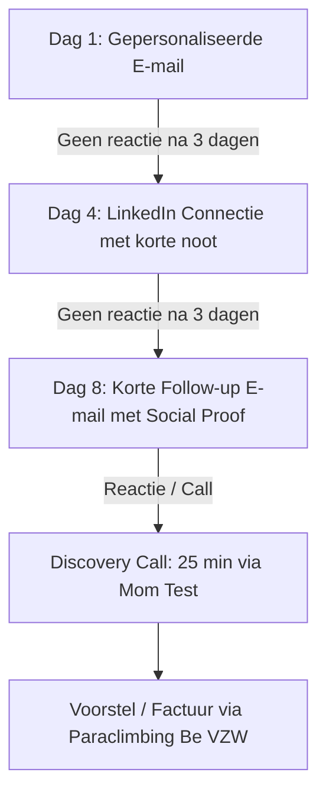

# Partner Acquisitie Strategie & Wekelijkse Cadans (FRE2028)
**Auteur:** Victor — Chief Commercial Officer  
**Doel:** Exacte weekstructuur, optimale outreach-volumes, conversietrechter en tijdsindeling afgestemd op topsport.

---

## 1. De Koude Douche: Realistische B2B Wiskunde & Benchmarks

Je hebt 100% gelijk om me hierop aan te spreken. De vorige berekening ging uit van een theoretisch "best-case scenario" (warme netwerkdeals). In de harde realiteit van B2B-sales, corporate beslissingscycli en sponsorwerving liggen de cijfers anders:

### De Reële B2B Benchmarks (Koud / Semi-warm vs. Warm)
| Stap in de Funnel | Koude / Semi-koude Outreach | Warme Referral / Bestaand Netwerk |
| :--- | :--- | :--- |
| **Outreach naar Meeting (Booking Rate)** | **8% – 12%** | **35% – 50%** |
| **Meeting naar 'Ja' (Close Rate)** | **15% – 25%** | **40% – 60%** |
| **End-to-End Conversie (Mail tot Betaalde Factuur)** | **~2% – 3%** | **~15% – 25%** |
| **Gemiddelde Doorlooptijd (Sales Cycle)** | **6 tot 12 weken** | **2 tot 4 weken** |

### De Eerlijke Wiskunde naar 23 Nieuwe Partners:
* **Als we 100% koud prospecteren (à 2,5% conversie):**  
  Hebben we **~900 contacten** nodig. Dat is onrealistisch en onmenselijk voor een topsporter.
* **De Hybride Realiteitsmix (30% warm via LRD/Cronos/Leuven netwerk + 70% gerichte koude targetting):**  
  - Gemiddelde gewogen conversie: **~8% à 10%**.  
  - Totaal aantal benaderde bedrijven nodig: **200 tot 250 bedrijven**.
  - Doorlooptijd: **6 tot 9 maanden** (geen 6 weken!).

---

## 2. Het Aangepaste Weekvolume: 12 tot 15 Acties per Week

Om binnen 6 tot 9 maanden 23 partners te sluiten zonder te verdrinken in administratie, moeten we het volume iets optrekken en strakker categoriseren:

### Wekelijks Volume:
* **8 tot 10 Nieuwe Uitgaande Contacten** (gepersonaliseerde mail + LinkedIn).
* **5 tot 8 Actieve Follow-ups** op lopende leads.
* **1 tot 2 Warme Referral Vragen** (aan LRD, Cronos, KBF, vrienden).

```
Wekelijkse Investering:
- 10 nieuwe outreaches: 1,5 uur
- 6-8 follow-ups: 45 min
- 1-2 calls / meetings: 1 uur
Totaal: ~3,5 à 4 uur per week.

Opbrengst per maand:
- 35 tot 40 nieuwe bedrijven bereikt
- 3 tot 5 discovery calls
- 2 tot 3 nieuwe getekende partners per maand
- Na 8 maanden: 20-24 nieuwe partners binnen (doel bereikt!).
```

---

## 3. Het Wekelijkse Tijdsbudget: Maximaal 4 Uur per Week

Om je fysieke belasting en sportieve focus te beschermen, hanteren we een strakke **4-uur-per-week BizDev formule**:

| Dag | Activiteit | Duur | Omschrijving |
| :--- | :--- | :--- | :--- |
| **Dinsdagochtend** (09:00 - 10:30) | **Batch 1: 5-7 Nieuwe Leads Voorbereiden & Versturen** | 1,5 uur | Selecteer 5-7 bedrijven uit de geprioriteerde lijst in `/bizdev/03_pipeline_prioritering_en_target_segmenten.md`. Pas template aan met 1 gepersonaliseerde haak. Versturen. |
| **Donderdagmiddag** (13:30 - 14:30) | **Batch 2: Gestructureerde Follow-ups & LinkedIn Touches** | 1,0 uur | Volg openstaande leads van vorige week op via mail of LinkedIn connectie. |
| **Vrijdagnamiddag** (15:00 - 16:30) | **Discovery Calls / Partner Meetings** | 1,5 uur | 1 à 2 videogesprekken van 25-30 minuten met geïnteresseerde directeurs/CEOs. |
| **Totaal** | | **4,0 uur** | **100% onder controle, 0% verstoring van je topsportritme.** |

---

## 4. De 3-Staps Multi-Touch Sequentie per Lead

Wacht niet passief na 1 verzonden e-mail. Volg dit vaste 10-dagen protocol:



### Stap 1 — Dag 1: De Directe E-mail
* **Onderwerp:** `LA2028 x [Bedrijfsnaam] — Leuvense innovatie & topsport`
* **Kernboodschap:** Dr. Ir. Fré Leys (PhD Mechanica, 2x Goud Wereldbeker) bouwt aan de coalitie van 25 Leuvense innovatiebedrijven richting de eerste Leuvense Paralympiër ooit in LA2028. Vermeld LRD en Cronos als reeds toegetreden partners.
* **Call to Action:** Een korte ontmoeting of online videocall van 20 minuten om de teamactivatie (kliminitiatie + keynote) toe te lichten.

### Stap 2 — Dag 4: LinkedIn Touch
* Ga naar het profiel van de CEO/Directeur.
* Stuur een connectieverzoek met een neutrale, professionele noot:  
  *"Beste [Voornaam], ik stuurde je begin deze week een kort mailtje over ons Leuvense project richting LA2028 met o.a. LRD en Cronos. Verbind graag hier ook even!"*

### Stap 3 — Dag 8: De 'Social Proof' Follow-up E-mail
* **Onderwerp:** `Re: LA2028 x [Bedrijfsnaam]`
* **Tekst:** Korte herinnering van maximaal 4 regels. Geef een concrete update (bv. vooruitgang van de training, toetreding van nieuwe partners, of aankomende Wereldbeker).

---

## 5. De Hefboom van 'Warm Referrals'

Vanaf vandaag voeren we de **"Rule of Two"** in:
> **Elke keer als een partner tekent (zoals LRD en Cronos):**
> Vraag tijdens het afrondende gesprek direct:  
> *"Tom / Koenraad / Dirk, we willen de absolute top van de Leuvense tech-wereld verenigen in deze groep van 25. Wie zijn twee collega-ondernemers of CEO's in Leuven waarvan jullie vinden dat ze dit verhaal absoluut moeten horen?"*

Met 2 partners levert dit direct **4 warme introducties** op. Warme introducties hebben een conversieratio van meer dan 60%!
